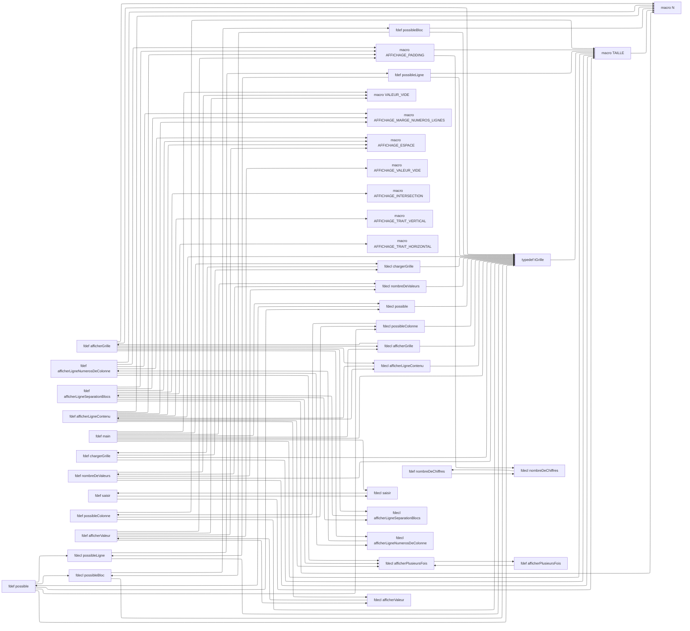

# Namelazz

Order things that depend on each other.

- Functions in a programing language
- Production rules in a formal grammar
- Nodes in a Mermaid flowchart
- ...

## Ordering system

Goal : canonical, human ordering.

We want to see the big picture first. Keep the most fundamental and atomic details at the bottom, and the great overseering items at the top.

In concrete terms:

- Items that have no dependents (*roots*) are first;
- Items that have no dependencies (*leaves*) are last;
- Items are sorted by count of dependents
- Custom rules possible (such as alphabetical sorting on other properties)
- Base items only have dependencies.
- Dependencies should be as close as possible to their dependents

An item's *name* identifies it uniquely. In a context of a programming language, it might be function's name. If function overloading is supported, it would include the function's arguments.

An item can specify it needs to be defined before its dependents. This is the case for C macros, for instance.

## Example

A single-file Sudoku game.

Symbol list:

Kind|Name
-|-
Macro|AFFICHAGE_ESPACE
Macro|AFFICHAGE_INTERSECTION
Macro|AFFICHAGE_INTERSECTION
Macro|AFFICHAGE_MARGE_NUMEROS_LIGNES
Macro|AFFICHAGE_PADDING
Macro|AFFICHAGE_TRAIT_HORIZONTAL
Macro|AFFICHAGE_TRAIT_VERTICAL
Macro|AFFICHAGE_VALEUR_VIDE
Macro|N
Macro|TAILLE
Macro|VALEUR_VIDE
Type definition|tGrille
Function declaration|afficherGrille
Function declaration|afficherLigneContenu
Function declaration|afficherLigneNumerosDeColonne
Function declaration|afficherLigneSeparationBlocs
Function declaration|afficherPlusieursFois
Function declaration|afficherValeur
Function declaration|chargerGrille
Function declaration|nombreDeChiffres
Function declaration|nombreDeValeurs
Function declaration|possible
Function declaration|possibleBloc
Function declaration|possibleColonne
Function declaration|possibleLigne
Function declaration|saisir
Function definition|afficherGrille
Function definition|afficherLigneContenu
Function definition|afficherLigneNumerosDeColonne
Function definition|afficherLigneSeparationBlocs
Function definition|afficherPlusieursFois
Function definition|afficherValeur
Function definition|chargerGrille
Function definition|main
Function definition|nombreDeChiffres
Function definition|nombreDeValeurs
Function definition|possible
Function definition|possibleBloc
Function definition|possibleColonne
Function definition|possibleLigne
Function definition|saisir

Now, for the dependency graph (Doxygen `@ref` doesn't count as a dependency):

Function definitions and their declarations are interdependent.

A function definition's only dependencies are its declarations.

