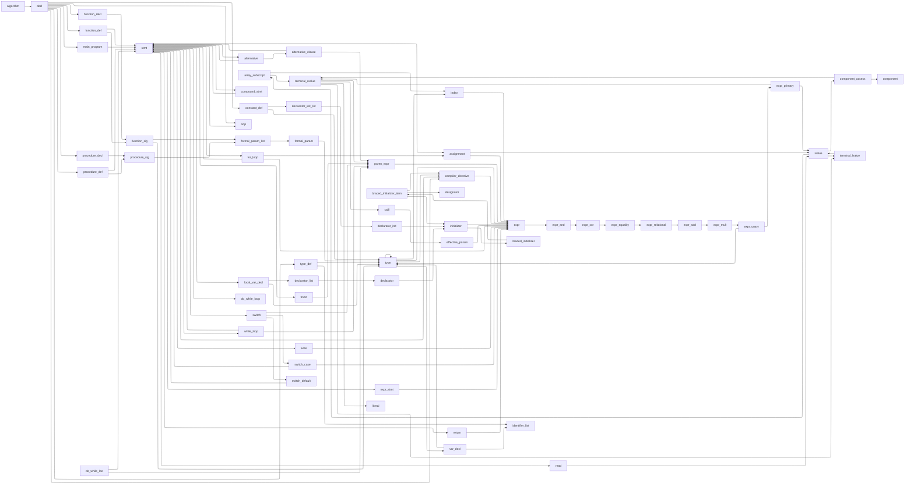

# Pseudocode24Parser

See [original](/home/raphael/Documents/Programmation/Projets/psdc.wiki/grammar/Pseudocode24Parser.g4)

```mermaid
%%{init: {"flowchart": {"defaultRenderer": "elk"}} }%%
flowchart LR
algorithm-->decl
alternative-->alternative_clause
alternative-->stmt
alternative_clause-->paren_expr-->expr-->expr_and-->expr_xor-->expr_equality-->expr_relational-->expr_add-->expr_mult-->expr_unary
alternative_clause-->stmt
array_subscript-->index-->expr
array_subscript-->terminal_rvalue
assignment-->expr
assignment-->lvalue
braced_initializer-->braced_initializer_item
braced_initializer_item-->compiler_directive-->expr
braced_initializer_item-->designator
braced_initializer_item-->initializer
calll-->effective_param-->expr
component_access-->component
component_access-->terminal_rvalue
compound_stmt-->stmt
constant_def-->declarator_init_list-->declarator_init-->initializer
constant_def-->type
decl-->compiler_directive
decl-->constant_def
decl-->function_decl-->function_sig
decl-->function_def
decl-->main_program-->stmt
decl-->nop
decl-->procedure_decl-->procedure_sig-->formal_param_list-->formal_param-->type
decl-->procedure_def
decl-->type_def
declarator-->initializer
declarator_list-->declarator
do_while_loo-->paren_expr
do_while_loo-->stmt
expr_primary-->lvalue
expr_primary-->terminal_rvalue
expr_stmt-->expr
expr_unary-->expr_primary
expr_unary-->type
for_loop-->assignment
for_loop-->expr
for_loop-->stmt
function_def-->function_sig
function_def-->stmt
function_sig-->formal_param_list
function_sig-->type
initializer-->braced_initializer
initializer-->expr
local_var_decl-->declarator_list
local_var_decl-->type
lvalue-->array_subscript
lvalue-->component_access
lvalue-->terminal_lvalue-->lvalue
procedure_def-->procedure_sig
procedure_def-->stmt
read-->lvalue
return-->expr
stmt-->alternative
stmt-->assignment
stmt-->compiler_directive
stmt-->compound_stmt
stmt-->do_while_loop
stmt-->expr_stmt
stmt-->for_loop
stmt-->local_var_decl
stmt-->nop
stmt-->read
stmt-->return
stmt-->switch
stmt-->trunc-->paren_expr
stmt-->while_loop
stmt-->write-->expr
switch-->paren_expr
switch-->switch_case
switch-->switch_default-->stmt
switch_case-->expr
switch_case-->stmt
terminal_rvalue-->calll
terminal_rvalue-->literal
terminal_rvalue-->paren_expr
terminal_rvalue-->terminal_lvalue
type-->compiler_directive
type-->expr
type-->index
type-->type-->var_decl
type_def-->identifier_list
type_def-->type
var_decl-->identifier_list
var_decl-->type
while_loop-->paren_expr
while_loop-->stmt
```
